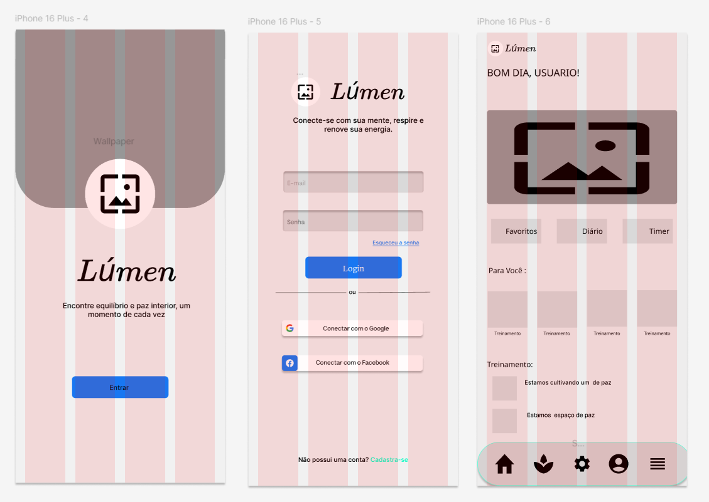

# Prototipo-Navegavel
Porjeto proposto no ultimo desafio do curso Formação UX Designer - DIO.

# Descrição
Este projeto apresenta um protótipo desenvolvido no Figma para um aplicativo móvel focado em práticas de meditação. O objetivo do aplicativo é oferecer uma experiência simples, intuitiva e acessível, servindo como uma plataforma versátil para a prática de diferentes formas de meditação, atendendo às diversas necessidades e preferências dos usuários.

# Funcionalidades Iniciais:
* Tela de Boas-Vindas :
  * Propósito: Introduzir o aplicativo ao usuário e convidá-lo a iniciar a jornada.
  * Funcionalidade: Exibe o logotipo e o slogan do aplicativo ("Encontre equilíbrio e paz interior, um momento de cada vez") para criar uma boa primeira impressão. O botão "Entrar" leva o usuário à próxima etapa, que é o login ou cadastro.

* Tela de Login:
  * Propósito: Permitir que os usuários façam login na sua conta ou se registrem no aplicativo.
  * Funcionalidades:
    * Campo para inserção de e-mail e senha.
    * Link "Esqueceu a senha" para recuperação de acesso.
    * Botão "Login" para autenticação.
    * Opções de login rápido através de contas do Google e Facebook.

* Tela Principal:
  * Propósito: Apresentar o conteúdo principal e as funcionalidades principais do aplicativo ao usuário.
  * Funcionalidades:
    * Saudação personalizada ("Bom dia, USUARIO!") para criar uma conexão acolhedora.
    * Ícone de imagem no centro como destaque visual.
  * Botões de acesso rápido:
    * Favoritos: Acesso a conteúdos salvos pelo usuário.
    * Diário: Registro de meditações ou reflexões do usuário.
    * Timer: Ferramenta para cronometrar sessões de meditação.
  * Seção "Para Você": Sugestões de treinamentos personalizados.
  * Barra de navegação inferior com cinco ícones para:
     * Página inicial (ícone de casa).
     * Área de meditações para dormir (ícone de chama).
     * Configurações (ícone de engrenagem).
     * Perfil do usuário (ícone de pessoa).
     * Menu adicional (ícone de menu).

# Desenvolvimento:

# Como visualizar o prototipo:

Para visualizar o prototipo pode ser acessado por duas formas, o Explorar onde é possivel ver o projeto funcionando o navegavel para ter a experiencia do usuario e a parte com o wireframe.
* Prototipo:
* Explorar: 

# Imagens do projeto: 

###### Wireframe:

<h5 align="center">
  
</h1>

###### Design System:
<h5 align="center">
  
</h1>

###### Prototipo:
<h5 align="center">
  
</h1>

# Contribuição
Este é um protótipo inicial do aplicativo, criado para explorar e validar conceitos. Caso tenha sugestões de melhorias ou deseje colaborar com o desenvolvimento, fique à vontade para registrar feedback ou enviar pull requests diretamente neste repositório.
